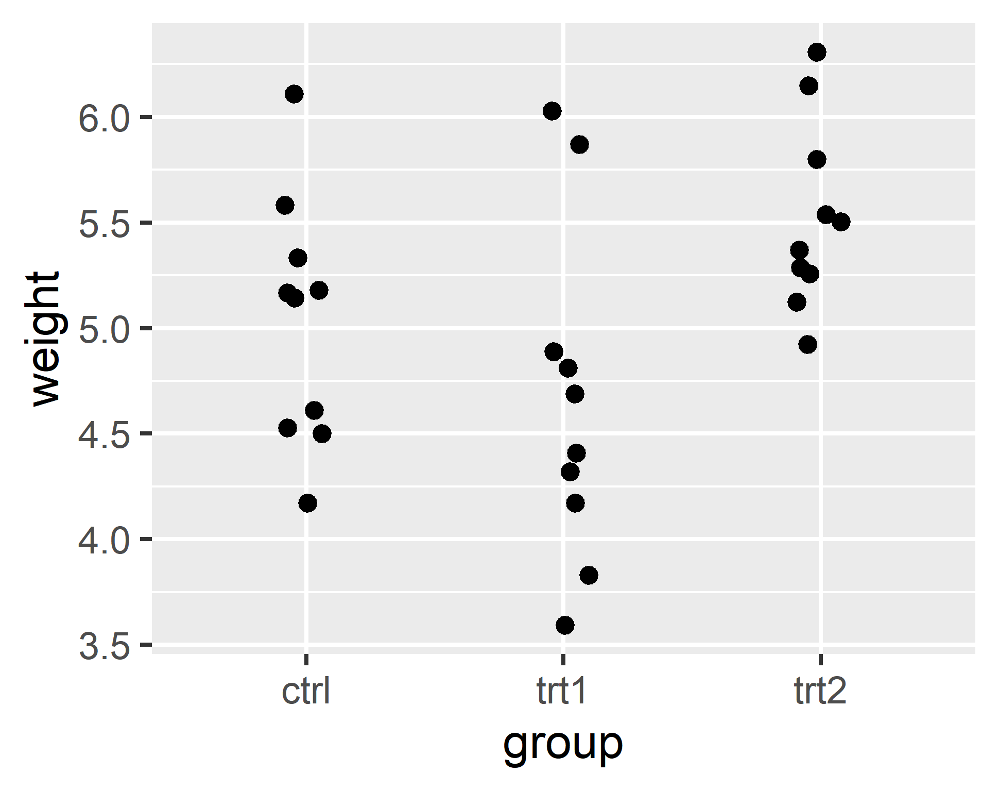
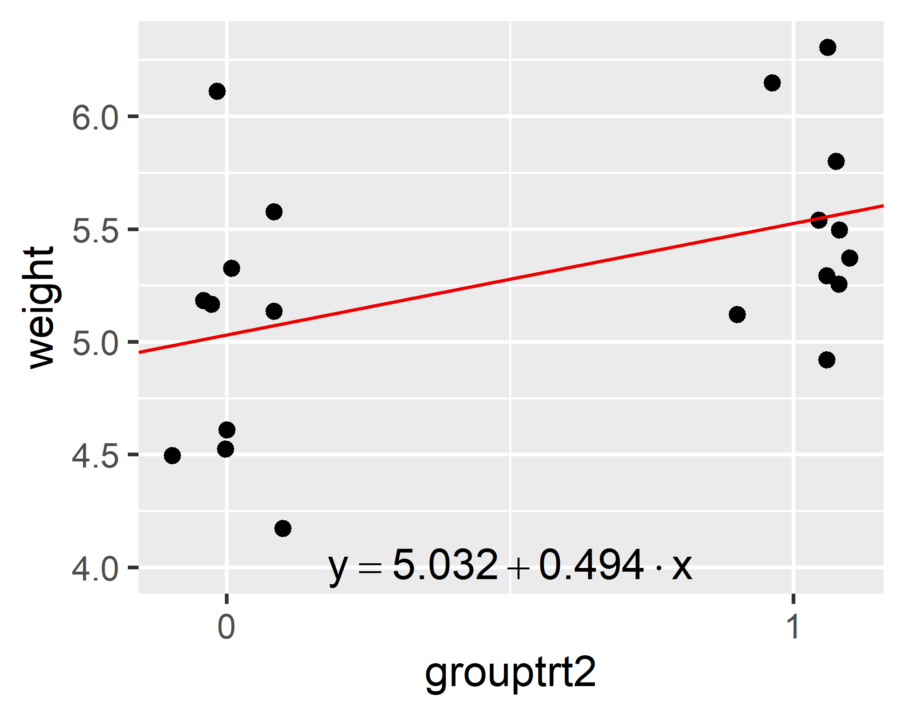
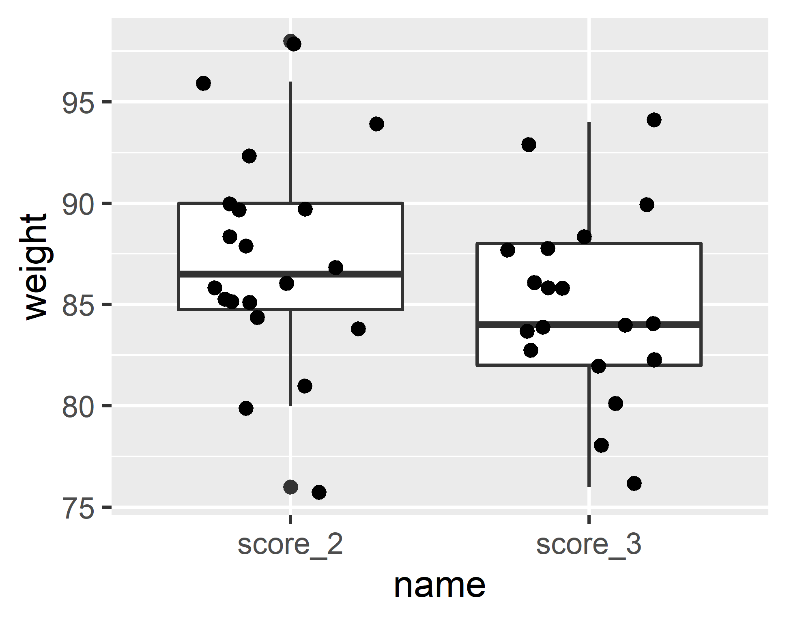
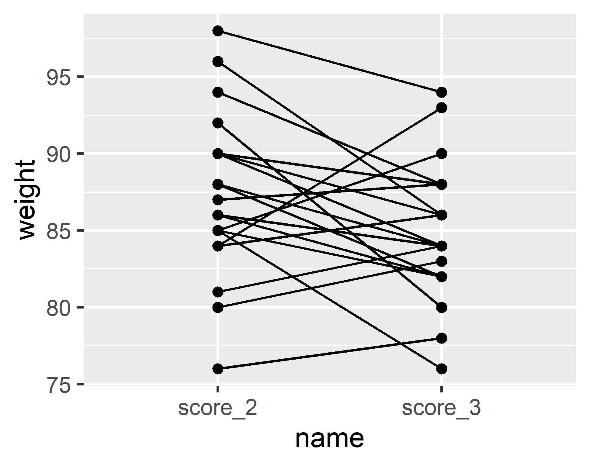

layout: true
  
<div class="my-footer"><span>Qiao-Guo Tan/CEE/XMU | tanqg@xmu.edu.cn | 2025-May-08   
&emsp;&emsp;&emsp;&emsp;&emsp;&emsp;&emsp;&emsp;&emsp;&emsp;&emsp;&emsp;&emsp;
&emsp;&emsp;&emsp;&emsp;&emsp;&emsp;&emsp;&emsp;&emsp;&emsp;&emsp;&emsp;&emsp;
</span></div> 


---

background-image: url("figs/models_1.png")
background-position: center
background-size: contain


---

background-image: url("figs/prar_t.png")
background-position: center
background-size: contain

##  参数*t*检验  
   

---

### 了解数据`PlantGrowth`   

```r
?PlantGrowth
```
> Results from an experiment to compare yields (as measured by dried weight of plants) obtained under a control and two different treatment conditions.  

> A data frame of 30 cases on 2 variables (weight, group).

> Source: Dobson, A. J. (1983) An Introduction to Statistical Modelling. London: Chapman and Hall.

.pull-left[
```{r}
head(PlantGrowth)
```
]

.pull-right[
```{r}
unique(PlantGrowth$group) #分了哪几组？
```
]

---

### 作图了解数据  

.pull-left[
```{r echo=F, message=F, warning=F}
library(ggplot2)
```

```r
library(ggplot2)

ggplot(PlantGrowth, aes(group, weight))+
  geom_jitter(width = 0.1)

```

```{r echo=F, out.width=291*1.6, out.height=230*1.6}

```
]

.pull-right[
**说明**：  
- 该数据有3个处理水平，本应采用ANOVA分析

- 以下为了演示*t*检验，选择其中2个处理水平分析  

]


---

### 筛选数据用于*t*检验  

- **提出问题**：第2种处理对植物的生长有无显著影响（相比于对照组）？  

- **筛选数据**：筛选`ctrl`、`trt2`两组数据 

```{r}
d1 <- subset(PlantGrowth, group %in% c("ctrl", "trt2"))

d1[sample(1:20, 8),] # 从20行数据中随机筛选8行查看  

```

---

## *t*检验的步骤  

.large[
1.  正态分布检验

2.  方差齐性检验

3.  选择合适的方法，*t*检验

4.  结果解读    

5.  计算效应值（effect size）

]


---

class: inverse, middle, center 

## 正态分布检验  


---

### 正态分布检验：`shapiro.test()`函数  

- 小样本表现优越（最小可以到*n* = 3），大样本下仍有效  
- 最常被推荐用于正态性检验的方法  

.pull-left[
```{r highlight.output=c(5)}
d1_ctrl <- subset(d1, group == "ctrl") # 筛选ctrl组数据  
shapiro.test(d1_ctrl$weight) # 检验ctrl组数据是否正态分布
```
]

.pull-right[
```{r highlight.output=c(5)}
d1_trt2 <- subset(d1, group == "trt2") # 筛选trt2组数据  
shapiro.test(d1_trt2$weight) # 检验trt2组数据是否正态分布

```
]

- 两组*p*值均> 0.05，表明所检验数据与正态分布无显著区别，可接受正态分布假设。

- 若拒绝正态分布假设，则需采用稳健性（Robust）检验或非参数检验（Mann-Whitney Test）


---

### 正态分布检验：`Kolmogorov-Smirnov`函数 


- Kolmogorov-Smirnov适合用来检验一个样本是否来自任意已知分布（比如正态、对数正态、指数等），但对正态性并不特别敏感  

```{r highlight.output=5}
ks.test(d1_ctrl$weight, "pnorm", mean = mean(d1_ctrl$weight), sd = sd(d1_ctrl$weight))
ks.test(d1_trt2$weight, "pnorm", mean = mean(d1_trt2$weight), sd = sd(d1_trt2$weight))

```
???

install.packages("tseries")
library(tseries)
jarque.bera.test(d1_trt2$weight)

https://datasharkie.com/how-to-test-for-normality-in-r/


---
### 正态分布检验：`nortest::ad.test`函数 

* Anderson-Darling检验：对尾部更敏感  
```{r}
library(nortest)   # install.packages("nortest")
ad.test(d1_ctrl$weight)
ad.test(d1_trt2$weight)
```

---
### 常用正态性检验方法对比表

```{r , echo=FALSE}
# 加载 knitr 包
library(knitr)

# 构建数据框
df_normality <- data.frame(
  方法 = c("Shapiro-Wilk 检验", 
           "Kolmogorov-Smirnov 检验", 
           "Anderson-Darling 检验", 
           "Lilliefors 检验", 
           "Jarque-Bera 检验"),
  原理 = c(
    "基于排序样本值与正态期望值的相关性",
    "样本经验分布与理论分布最大差值的检验",
    "对尾部偏离更敏感的改进型 EDF 检验",
    "K-S 检验在参数未知下的修正版本",
    "基于偏度和峰度构建统计量的检验"
  ),
  特点 = c(
    "精度高，对偏态和峰度敏感，广泛推荐",
    "通用性强但对正态性不够敏感",
    "对尾部偏差敏感，性能优于 K-S",
    "适用于不知道均值和方差的情况",
    "适用于大样本，计算简便"
  ),
  适用性 = c(
    "小样本和中等样本，常用于正态性检验",
    "检验样本是否服从任意理论分布，非专为正态性设计",
    "更稳健的正态性检验方法，适合各种样本量",
    "用于正态性检验但需配合模拟计算临界值",
    "大样本数据、用于经济与金融领域较多"
  ),
  stringsAsFactors = FALSE
)

# 输出表格
kable(df_normality, align = "l")
```


---

class: inverse, middle, center 

## 方差齐性检验 

---

### 方差齐性检验：`bartlett.test() `函数  


```{r highlight.output=c(5)}
bartlett.test(weight ~ group, data = d1)

```

**解读：**  

- *p* = 0.4236，大于0.05，表明两组数据方差无明显差异，可接受方差齐性假设。  

- 若方差不齐，则需采用**Welch *t*检验**（其实R默认采用Welch *t*检验）。

---

### 方差齐性检验：其他可用函数 


- **F-test**，仅适用于两组呈正态分布的数据     

```{r highlight.output=c(5)}
var.test(weight ~ group, data = d1) 
```


---

### 方差齐性检验：其他可用函数 


- **Levene’s test**，当数据不呈正态分布时可用   

```{r highlight.output=c(3)}
car::leveneTest(weight ~ group,  data = d1) #需调用car程序包
```


- **Fligner-Killeen test**，非参数检验，当数据不呈正态分布时可用  

```{r highlight.output=c(5,6)}
fligner.test(weight ~ group, data = d1) 
```


???

Compare Multiple Sample Variances in R
http://www.sthda.com/english/wiki/compare-multiple-sample-variances-in-r

---

### 方差齐性检验方法对比表

```{r, echo=FALSE}
knitr::kable(
  data.frame(
    方法 = c("Bartlett 检验", "F 检验", "Levene 检验", "Fligner-Killeen 检验"),
    原理 = c(
      "基于对数方差的卡方检验",
      "方差比服从 F 分布",
      "偏差的方差分析（使用平均数或中位数）",
      "基于秩的非参数检验"
    ),
    特点 = c(
      "对正态性敏感，效率高",
      "仅限两组，对正态性敏感",
      "对非正态和偏态更稳健",
      "最稳健，适用于各种分布"
    ),
    适用性 = c(
      "正态分布数据，>2组",
      "两组正态数据",
      "多组偏态或非正态数据",
      "强偏态、离群值、非参数场景"
    )
  ),

  align = "l"
)
```


---
class: center  
<br>
<br>
### R默认的*t*检验是Welch's *t*检验，  

--
### 不是标准的Student's *t*检验，  

--
### 因此不依赖于**方差齐性**假设，  

--
### 可以不检验方差齐性。  


---
class: inverse, center, middle  

## 独立双样本*t*检验

---

### `t.test()`函数的两种用法

- ### 用法1：   
`t.test(formula, data, ...)`
  * 数据以**长数据表**输入  
  * 只适用于双样本独立*t*检验

- ### 用法2：
`t.test(x, y = NULL, alternative = c("two.sided", "less", "greater"), mu = 0, paired = FALSE, var.equal = FALSE, conf.level = 0.95, ...)`
  * 数据以**宽数据表**输入  
  * 可用于所有类型*t*检验：双样本 & 单样本，独立 & 配对   
  

---

### Welch's *t*检验  

.pull-left[
```{r, highlight.output=c(2,5)}
t.test(weight ~ group, data = d1)

```
]

.pull-right[
**结果解读：**  
- **p-value = 0.0479**：两种处理之间有显著区别，*t*(16.786) = -2.134， *p* = 0.048

- **t = -2.134, df = 16.786**：注意Welch *t*检验的自由度经过校正，通常不是整数   

- **95 percent confidence interval: -0.98287213 -0.00512787**：这是（ctrl组的均值 - trt2组的均值）之差的置信区间，区间不包含0，也表明差值显著低于0    

- **Welch Two Sample t-test**：不是Student *t*-test，无需满足方差齐性 

]

---

### Student's *t*检验

.large[由于之前的方差齐性检验得知*p* > 0.05，满足方差齐性假设，因此可以在检验时设定`var.equal = TRUE`，进行Student's *t*检验。]    

```{r, highlight.output=c(2,5)}
t.test(weight ~ group, data = d1, var.equal = TRUE)


```

---

### 单侧*t*检验  

若对两个均值的大小关系已有预期，则可采用单侧*t*检验。单侧、双侧检验回答的问题不同，备择假设不同，即：  

- **单侧检验**：**`ctrl`**组的`weight`均值小于**`trt2`**组的`weight`均值吗？  
 * 备择假设：`ctrl` < `trt2`  
<br>
  
- **双侧检验**：**`ctrl`**组的`weight`均值和**`trt2`**组的`weight`均值有显著差异吗？  
 * 备择假设：`ctrl` ≠  `trt2`  

```{r, highlight.output=c(5,6)}
t.test(d1_ctrl$weight, d1_trt2$weight, alternative = "less") #从图上看判断ctrl组略小于trt2组，所以设定"less"  
```
**注意**： （1） 单侧检验的备择假设（alternative hypothesis）和双侧检验备择假设的区别；（2）单侧检验的*p*值为双侧检验的一半，提高了检测能力   

---

class: inverse, middle, center

## *t*检验是一种线性回归


---

### *t*检验是一种特殊的线性回归  

> *t*检验本质上是预测变量为分类变量的线性回归  


--

.pull-left67[
```{r}
mod.1 <- lm(weight ~ group, data = d1)
summary(mod.1)
```
]

--

.pull-right67[
**结果解读：**  

`weight = 5.0320 + 0.4940 × grouptrt2`   

- 自动设置虚拟（dummy）变量`grouptrt2`：ctrl组为0，trt2组为1  

- 截距是ctrl组的均值  

- 斜率是两组均值之差  

- *p*值是0.04685，和之前Student's *t*-test完全一致  
]

---

### 作图理解*t*检验和线性回归之间的关系    

```r
d1$grouptrt2 <- ifelse(d1$group == "trt2", 1, 0) #设置虚拟变量，trt2组为1，ctrl组为0
ggplot(d1, aes(grouptrt2, weight))+
  geom_jitter(width = 0.1)+
  geom_abline(slope = 0.4940, intercept = 5.0320, color = "red2")+
  annotate(geom = "text", x = 0.5, y = 4, label = "y==5.0320+0.4940%.%x", parse = T)+
  scale_x_continuous(breaks = c(0, 1))
```
.pull-left[

```{r echo=F, out.width=291*1.5, out.height=230*1.5}

```
]

.pull-right[
**从图上可以看出**：
- 截距是ctrl组的均值  

- 斜率是两组均值之差      

- 如果线性回归的*p* < 0.05，说明斜率显著区别于0，等价于：trt2组的均值显著区别于ctrl组的均值
]

---
class: inverse, center, middle  

## 配对样本*t*检验


---

### 配对*t*检验

.largem[
某课程布置了3次作业，已完成评分。  

**提出问题**：作业2和作业3的平均分是否有显著差异？  
]

--

.largem[
假设每次作业抽20人进行分析，有两种不同的做法：  

1. 作业2随机抽20人，作业3也随机抽20人，对比两次平均分  

2. 随机抽取20人，对比其作业2和作业3两次作业得分
]

--

.largem[

做法1：独立*t*检验  

做法2：配对*t*检验，对每位同学进行了2次测定（此实验设计检测差异的能力更**强**）
]

---

### 了解数据  

```{r message=F, warning=F}
ID <- 1:20
S2 <- c(94,86,85,90,90,86,84,98,88,92,85,96,84,76,85,87,90,88,80,81) #作业2分数
S3 <- c(88,82,76,84,88,84,93,94,82,80,82,86,86,78,90,88,86,84,83,84) #作业3分数
d_score <- data.frame(ID, S2, S3)
head(d_score)
```

**注意**：数据整理成宽表格，以适应配对*t*检验的格式  

---

### 作图了解数据 

```{r message=F, warning=F}
library(dplyr)
library(tidyr)
d2 <- d_score %>%
  pivot_longer(cols=2:3) #宽表格变长表格，以便作图
```


.pull-left[
- **未体现配对**
```r
ggplot(d2, aes(name, value))+
  geom_boxplot()+
  geom_jitter(width = 0.3)
```  

```{r echo=F, out.width=291, out.height=230}

```
]

.pull-right[
- **体现配对**  

```r

ggplot(d2, aes(name, value))+
  geom_point()+
  geom_line(aes(group = ID))
```

```{r echo=F, out.width=291, out.height=230}

```
]

---

### 配对*t*检验  

- 检验差值是否呈正态分布（注意不是检验原始数据）  

```r
shapiro.test(d_score$S2 - d_score$S3) # p-value = 0.8607，两次测定之差呈正态分布
```
.pull-left67[
- 配对*t*检验
```{r highlight.output=5}
t.test(d_score$S2, d_score$S3, paired = T)
```
]

.pull-right67[
**结果解读**：

- 两次得分无显著差异（paired *t*-test, *t*(19) = 1.98, *p* = 0.063）  

- 可以预见：若采用单侧检验，作业2得分显著高于作业3（1-tailed paired *t*-test, *t*(19) = 1.98, *p* = 0.031）
]

---

class: inverse, middle, center  

## 单样本*t*检验 

---

### 单样本*t*检验

**问题**：CO标准气体样品的参考值是70ppm，现用仪器测定6次，读数分别为72，79，65，84，67，77，该仪器的测定值和标准参考值是否有显著差异？

```{r highlight.output=5}
d_CO <- c(72, 79, 65, 84, 67, 77)
t.test(d_CO, mu=70)
```

**结果**：*p* = 0.2384，大于0.05，接受原假设，该仪器的测定值与标准参考值70无显著差异。

---

### 配对*t*检验等价于单样本*t*检验

**配对*t*检验**：即检验差值与0是否有显著差异  

- 单样本*t*检验:  
```{r}
t.test(d_score$S2 - d_score$S3, mu = 0)
```

结果与配对*t*检验完全一致

---

class: inverse, middle, center  

## *t*检验的稳健方法  

---

### 独立*t*检验稳健方法：`WRS2`程序包  

.large[如果数据不满足参数*t*检验的要求（如正态分布、方差齐性），可采用稳健（robust）方法。]  

- 生成关于男女体重的数据<sup>[1]</sup>  

```{r}
women_wt <- c(38.9, 61.2, 73.3, 21.8, 63.4, 64.6, 48.4, 48.8, 48.5)
men_wt <- c(67.8, 60, 63.4, 76, 89.4, 73.3, 67.3, 61.3, 62.4) 
d3 <- data.frame(grp = rep(c("woman", "man"), each = 9),
                  wt = c(women_wt, men_wt))
```
[1] 数据来自：http://www.sthda.com/english/wiki/unpaired-two-samples-wilcoxon-test-in-r

---

### 独立*t*检验稳健方法：`WRS2`程序包   

- `WRS2`程序包提供的Robust方法  

```{r }
library(WRS2)
```

- 方法1：  

```{r highlight.output=4}
yuen(wt ~ grp, data = d3) #默认设置tr = 0.2，即切去最大20%和最小20%的数，然后进行Welch t检验；如果置tr = 0，就是Welch t检验
```
???

Note that if no trimming is involved, this method reduces to Welch’s classical t-test with unequal variances (Welch 1938), as implemented in t.test

---

### 独立*t*检验稳健方法：`WRS2`程序包 

- 方法2：

.pull-left67[
```{r highlight.output=4}
yuenbt(wt ~ grp, data = d3, tr = 0.2, nboot = 2000) #yuen的bootstrap版本
```

* bootstrap：自展法、自举法、自助法、靴带法、拔靴法、靴襻法
]

--

.pull-right67[
```{r echo=F, out.width=940/2.5, out.height=524/2.5}
knitr::include_graphics("figs/bootstrap.png")
```
]


---

### 独立*t*检验稳健方法：`WRS2`程序包 

- 方法3：
```{r highlight.output=4}
pb2gen(wt ~ grp, data = d3, est = "mom", nboot = 2000)
```

---
class: inverse, middle, center

## 效应值 <br> Effect Size

---

### 效应值  


$$r=\sqrt{\frac{ t^2}{t^2+df}}$$

.latge[
- 效应显著不一定意味着效应大

- 效应不显著也不意味着效应小  
- *t*值和*p*值反映效应显著与否  

- *r*值反映效应的大小
  * *r* = 0.10（small effect）
  * *r* = 0.30（medium effect）
  * *r* = 0.50（large effect） 

- 效应值便于快速理解研究结果，也便于将多个研究汇总、比较  
] 

???
Andy Field book, Page 58；

---

### 效应值的计算    

- 先做*t*检验

```{r}
test.1 <- t.test(weight ~ group, data = d1)
```

- 提取*t*值和自由度
```{r}
t <- test.1$statistic[[1]] #提取t值，双方括号的作用是提取数值，丢掉其他信息
df <- test.1$parameter[[1]] #提取自由度  
```

- 计算效应值   

```{r}
r <- sqrt(t^2/(t^2+df))
r
```
**结果解读**：处理2对于植物的生长有显著影响（*p* = 0.0479）,效应中等（*r* = 0.462）


---

class: inverse, center, middle

## 非参数*t*检验   

---

### 非参数*t*检验： `wilcox.test()`

以下同一检验的不同称呼：
- Wilcoxon rank-sum test
- Mann–Whitney U test
- Mann–Whitney–Wilcoxon (MWW)
- Wilcoxon–Mann–Whitney test


用`wilcox.test()`分析之前的男女体重数据  
```{r warning=F}
wilcox.test(women_wt, men_wt)
```
**结果**： *p* = 0.027，表明男女体重存在显著差异  


---

### 非参数*t*检验： `wilcox.test()`

- 分析PlantGrowth数据，与参数*t*检验结果对比  
```{r}
wilcox.test(weight ~ group, d1) # wilcox.test()函数也有两种用法  
```
**结果**：*p* = 0.06301，大于0.05，与之前Welch *t*检验结果不一致

???

Unpaired Two-Samples Wilcoxon Test in R
http://www.sthda.com/english/wiki/comparing-means-in-r

---
class: inverse, middle, center 
## 附：*t*检验的基础知识  


---

.pull-left[


- #### 独立双样本Student's *t*检验


$$t=\frac{\bar{x_1}-\bar{x_2}}{\sqrt{\frac{s^2}{n_1}+\frac{s^2}{n_2}}}$$
$$s^2=\frac{\sum{(x_{1i}-\bar{x_1})^2}+\sum{(x_{2i}-\bar{x_2})^2}}{n_1+n_2-2}$$

- #### 独立双样本Welch's *t*检验

$$t=\frac{\bar{x_1}-\bar{x_2}}{\sqrt{\frac{s_1^2}{n_1}+\frac{s_2^2}{n_2}}}$$


$$s_1=\sqrt{\frac{\sum(x_{1i}-\bar{x_1})^2}{n_1-1}}$$
$$s_2=\sqrt{\frac{\sum(x_{2i}-\bar{x_2})^2}{n_2-1}}$$
]


.pull-right[

- #### 配对样本*t*检验

$$t=\frac{\bar{d}}{s/\sqrt{n}}$$
$$s=\sqrt{\frac{\sum(d_i-\bar{d})^2}{n-1}}$$
*d*<sub>i</sub>是各对数据之差  

- #### 单样本*t*检验  

$$t=\frac{\bar{x}-\mu_0}{s/\sqrt{n}}$$

$$s=\sqrt{\frac{\sum(x_i-\bar{x})^2}{n-1}}$$
*n*是样本数
]
 
---

### 要点小结

.pull-left[
#### 参数*t*检验：`t.test()`

- 独立双样本*t*检验： 
  * Student's *t*检验：`t.test(var.equal=T)`  
  * Welch's *t*检验（R默认）：`t.test()`  
  * 单侧*t*检验：`t.test(alternative="g" or "l")`  

- 配对*t*检验：`t.test(paired = T)`  

- 单样本*t*检验：`t.test(mu = xx)`  
  
- 稳健*t*检验：`yuen()`，`yuenbt()`，`pb2gen()`  适合于样本数较大的数据

#### 非参数检验  
- Wilcoxon秩和检验：`wilcox.test()`
]

.pull-right[
#### 正态分布检验
- `shapiro.test()`
- `ks.test()`


#### 方差齐性检验 
- `bartlett.test()`
- `car::leveneTest()` 需两组数据均呈正态分布  
- `fligner.test()`

#### 效应值  
- 0.1 小  
- 0.3 中  
- 0.5 大  

#### *t*检验是一种线性回归
]


---

## 参考文献：

.large[Field A., Miles J., Field Z. 2012. Discovering Statistics Using R. SAGE Publications Ltd. Chapter 8 Comparing Two Means.]

## 推荐阅读：

.large[Comparing Means in R  
http://www.sthda.com/english/wiki/comparing-means-in-r]
